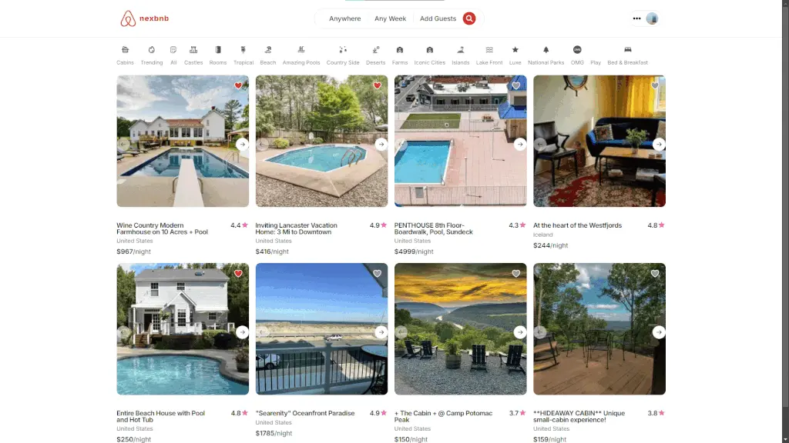

<div align="center">
  
# 🏠 NexBnB

### Modern Airbnb Clone Built with Next.js 14



[](https://nextjs.org/)
[](https://www.typescriptlang.org/)
[](https://reactjs.org/)
[](https://www.prisma.io/)
[](https://tailwindcss.com/)
[](https://clerk.com/)
[](https://supabase.com/)

[Features](#-features) • [Tech Stack](#-tech-stack) • [Getting Started](#-getting-started) • [Project Structure](#-project-structure)

</div>

---


## ✨ Features

### 🔐 Authentication & User Management

- Secure authentication powered by Clerk
- User profile management
- Protected routes and middleware

### 🏡 Property Listings

- Browse and search property listings
- Filter by categories, location, and amenities
- Interactive map integration with Leaflet
- Image carousel for property photos
- Detailed property information (guests, bedrooms, bathrooms)

### 📝 Host Features

- Create and manage property listings
- Multi-step listing creation process:
  - Structure (guests, bedrooms, bathrooms)
  - Description and details
  - Location and map placement
- Edit existing listings
- Track reservations

### 📅 Booking System

- Interactive calendar for date selection
- Real-time availability checking
- Reservation management
- View booking history

### ❤️ Favorites

- Save favorite properties
- Quick access to saved listings

### 🎨 Modern UI/UX

- Responsive design for all devices
- Smooth animations and transitions
- Loading states and skeleton screens
- Toast notifications
- Context menus and dropdowns

## 🛠 Tech Stack

### Frontend

- **Framework:** Next.js 14 (App Router)
- **Language:** TypeScript
- **Styling:** Tailwind CSS
- **UI Components:** Radix UI primitives
- **Forms:** React Hook Form + Zod validation
- **Date Handling:** date-fns, react-date-range
- **Maps:** Leaflet, React Leaflet
- **Carousel:** Embla Carousel
- **Icons:** Heroicons, Radix Icons, Iconify

### Backend

- **Database ORM:** Prisma
- **Database:** SQLite (development)
- **Authentication:** Clerk
- **File Storage:** Supabase
- **Server Actions:** Next.js Server Actions

### Developer Tools

- **Linting:** ESLint
- **Package Manager:** npm/yarn/pnpm

## 🚀 Getting Started

### Prerequisites

- Node.js 18+ installed
- npm, yarn, or pnpm package manager

### Installation

1. **Clone the repository**

   ```bash
   git clone https://github.com/niteshbabu/nexbnb.git
   cd nexbnb
   ```

2. **Install dependencies**

   ```bash
   npm install
   # or
   yarn install
   # or
   pnpm install
   ```

3. **Set up environment variables**

   Create a `.env.local` file in the root directory:

   ```env
   # Clerk Authentication
   NEXT_PUBLIC_CLERK_PUBLISHABLE_KEY=your_clerk_publishable_key
   CLERK_SECRET_KEY=your_clerk_secret_key
   NEXT_PUBLIC_CLERK_SIGN_IN_URL=/sign-in
   NEXT_PUBLIC_CLERK_SIGN_UP_URL=/sign-up

   # Supabase
   SUPABASE_URL=your_supabase_url
   SUPABASE_ANON_KEY=your_supabase_anon_key

   # Database (if using PostgreSQL)
   DATABASE_URL=your_database_url
   ```

4. **Set up the database**

   ```bash
   npx prisma generate
   npx prisma db push
   ```

5. **Run the development server**

   ```bash
   npm run start
   # or
   yarn start
   # or
   pnpm start
   ```

6. **Open your browser**

   Navigate to [http://localhost:3000](http://localhost:3000)

## 📁 Project Structure

```
nexbnb/
├── prisma/
│   └── schema.prisma          # Database schema
├── public/
│   └── images/                # Static images
├── src/
│   ├── app/                   # Next.js app directory
│   │   ├── (user)/           # User routes (auth)
│   │   ├── api/              # API routes
│   │   ├── favorites/        # Favorites page
│   │   ├── listings/         # Listing details
│   │   ├── my-listings/      # User's listings
│   │   ├── new-listing/      # Create listing flow
│   │   ├── reservations/     # User reservations
│   │   ├── layout.tsx        # Root layout
│   │   └── page.tsx          # Home page
│   ├── components/            # React components
│   │   ├── Forms/            # Form components
│   │   ├── Header/           # Header & navigation
│   │   ├── HomeListing/      # Home page components
│   │   ├── HotelListings/    # Listing components
│   │   ├── NewListing/       # Create listing components
│   │   ├── Pagination/       # Pagination components
│   │   └── ui/               # Reusable UI components
│   ├── data/                  # Static data (filters, hotels)
│   ├── hooks/                 # Custom React hooks
│   ├── lib/                   # Utility functions
│   │   ├── actions.ts        # Server actions
│   │   ├── db.ts             # Prisma client
│   │   └── supabase.ts       # Supabase client
│   ├── types/                 # TypeScript types
│   └── middleware.ts          # Next.js middleware
├── components.json            # shadcn/ui config
├── next.config.mjs            # Next.js configuration
├── tailwind.config.ts         # Tailwind CSS configuration
└── tsconfig.json              # TypeScript configuration
```

## 🗄️ Database Schema

The application uses Prisma ORM with the following main models:

- **User** - User profiles and authentication
- **Home** - Property listings
- **Location** - Geographic coordinates and addresses
- **Reservation** - Booking information
- **Favorite** - User's saved listings

## 🎨 UI Components

Built with Radix UI and styled with Tailwind CSS, the component library includes:

- Buttons, Cards, Forms
- Dialogs, Dropdowns, Context Menus
- Carousels, Pagination
- Toasts, Skeletons
- Date Pickers, Selects
- And more...

## 📱 Features in Detail

### Multi-step Listing Creation

1. **Structure** - Define property basics (guests, rooms, baths)
2. **Description** - Add title, description, and photos
3. **Address** - Set location with interactive map

### Search & Filter

- Category-based filtering
- Location search
- Date range selection
- Price range filtering
- Guest capacity filtering

### Interactive Maps

- Property location visualization
- Interactive map markers
- Geographic search capabilities

## 🙏 Tools I Used

- Built with [Next.js](https://nextjs.org/)
- UI components from [Radix UI](https://www.radix-ui.com/)
- Styled with [Tailwind CSS](https://tailwindcss.com/)
- Authentication by [Clerk](https://clerk.com/)
- Database with [Prisma](https://www.prisma.io/)
- Maps by [Leaflet](https://leafletjs.com/)

---

<div align="center">
Made with ❤️ using Next.js & Typescript
</div>
